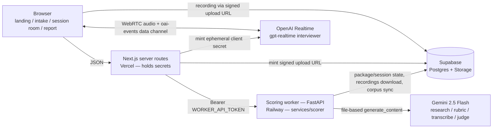

# flightcheck

**A pre-flight check for your English interview.** Paste the JD you're applying to; flightcheck interviews you by voice against that role's actual bar, scores both *what you said* (transcript) and *how you said it* (raw audio — native speech-to-speech, no transcription in the loop), and tells you honestly whether you're ready.

## v0.2 — live

- **App:** https://flightcheck.vercel.app
- **Sample report (no signup):** https://flightcheck.vercel.app/sample-report
  — a real practice session, anonymized

### How it fits together

### Quickstart

1. Open https://flightcheck.vercel.app/new and paste a job description or its URL;
   optionally attach a resume PDF and a LinkedIn "Save to PDF" export
   (no scraping — DECISIONS #003).
2. Wait for the rubric preview — 5-8 weighted dimensions, every one citing
   its sources — then press Start session and take the 20-minute voice
   interview in the browser (25-minute hard cut).
3. When scoring finishes, the report shows the verdict
   (not ready / approaching / ready), per-dimension evidence, delivery
   metrics, and concrete drills — honestly, including "not ready yet".

Release notes: [v0.2](docs/releases/v0.2.md) · [v0.1](docs/releases/v0.1.md).
Architecture detail (data flow, storage layout): [docs/architecture.md](docs/architecture.md).
Deploy runbook: [docs/deploy.md](docs/deploy.md).

> **Status: v0.2.** Built in public. PRD was committed before the first line of code — [read it](PRD.md). The S2S provider bake-off that picked the interviewer and scoring models is measured, not guessed ([report](evals/reports/2026-08-02-provider-bakeoff.md)); the release-gate eval numbers are committed verbatim, including the runs that failed ([2026-08-01 gate record](evals/reports/2026-08-01-v02-gate.md), [2026-07-26 gate run](evals/reports/2026-07-26-v01-gate.md)).

## Why not just ChatGPT voice?

1. **A verdict, not a chat** — an evidence-grounded rubric compiled from your target JD and real interview experiences for that company and role, with behaviorally-anchored scoring.
2. **Delivery is scored from raw audio** — hesitation, fillers, hedging intonation. Cascade pipelines erase these before the model ever hears them.
3. **Growth across sessions** *(planned: v0.4 session history, v0.5 curriculum)* — evidence map, recurring-weakness tracking, fresh questions every time, until Ready. Today: one baseline session per package.

## Roadmap

v0.1 full single-session loop — shipped 2026-07-26 → v0.2 interviewer UX (opens the call, tolerates thinking pauses, listens actively, manages the clock; the report explains its scores) — shipped 2026-08-01 → v0.3 report quality → v0.4 session history → v0.5 curriculum-lite → then payments ([DECISIONS.md](DECISIONS.md) #008). See [CHANGELOG.md](CHANGELOG.md); real-user metrics land with the first external pilot ([docs/metrics/](docs/metrics/)).

MIT · Built AI-natively — see [CLAUDE.md](CLAUDE.md) · Decisions logged in [DECISIONS.md](DECISIONS.md) · Patterns in [PLAYBOOK.md](PLAYBOOK.md) · Honest retros in [RETRO.md](RETRO.md)
