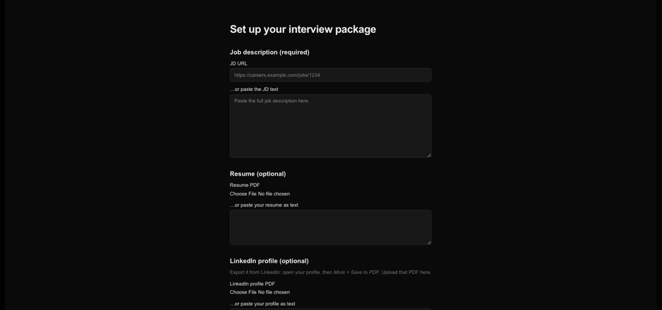
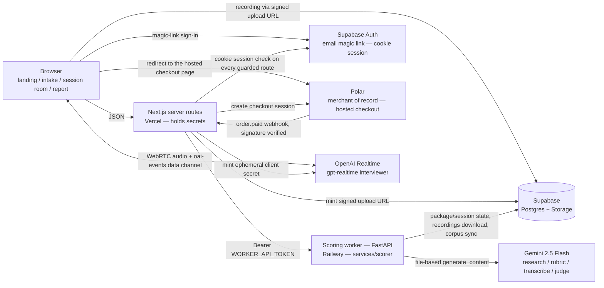

# flightcheck

**A pre-flight check for your English interview.** Paste the JD you're applying to; flightcheck interviews you by voice against that role's actual bar, scores both *what you said* (transcript) and *how you said it* (raw audio — native speech-to-speech, no transcription in the loop), and tells you honestly whether you're ready.

## v0.5 — live

- **App:** https://flightcheck.vercel.app
- **Sample report (no signup):** https://flightcheck.vercel.app/sample-report
  — a real session run by the developer, with identifying details removed
  (flightcheck has no external users yet)
- **Price:** $49 per job description. The first package on an account is a
  trial with one scored session; $49 unlocks that same package — same JD,
  same rubric — to six 20-minute sessions, and a 30-day window starts at
  payment. No subscription, and no card field in the app: Polar is the
  merchant of record and checkout happens on its page
  ([pricing](https://flightcheck.vercel.app/pricing), DECISIONS #017–#018).



*Captured at v0.2, four frames: intake, the compiled rubric with its weights
and sources, the session-room clock, the report. Not in it — sign-in, pricing,
checkout, the session archive, the progress screen, i.e. everything the
signed-in app grew afterwards. It gets re-recorded when the visual pass lands.*

### How it fits together



### Quickstart

1. Sign in at https://flightcheck.vercel.app/login — an email link, no password.
   Everything past the landing page is account-scoped: `/new` answers a
   signed-out visitor with a 307 to `/login?next=%2Fnew`. Then open
   https://flightcheck.vercel.app/new and paste a job description or its URL;
   optionally attach a resume PDF and a LinkedIn "Save to PDF" export
   (no scraping — DECISIONS #003). To read the output without an account, use
   the [sample report](https://flightcheck.vercel.app/sample-report) instead.
2. Wait for the rubric preview — 5-8 weighted dimensions, every one citing
   its sources — then press Start session and take the 20-minute voice
   interview in the browser (25-minute hard cut).
3. When scoring finishes, the report shows the verdict
   (not ready / approaching / ready), per-dimension evidence, delivery
   metrics, and concrete drills — honestly, including "not ready yet".

Release notes: [v0.2](docs/releases/v0.2.md) · [v0.1](docs/releases/v0.1.md) — the two
tagged releases before this one; v0.5 is the top section of [CHANGELOG.md](CHANGELOG.md).
Architecture detail (data flow, storage layout): [docs/architecture.md](docs/architecture.md).
Deploy runbook: [docs/deploy.md](docs/deploy.md).

> **Status: v0.5.** Built in public. PRD was committed before the first line of code — [read it](PRD.md); the chronology is checkable below rather than asserted. The S2S provider bake-off that picked the interviewer and scoring models is measured, not guessed ([report](evals/reports/2026-08-02-provider-bakeoff.md)); the release-gate eval numbers are committed verbatim, including the runs that failed ([2026-08-03 v0.5 gate](evals/reports/2026-08-03-v05-gate.md), [2026-08-01 gate record](evals/reports/2026-08-01-v02-gate.md), [2026-07-26 gate run](evals/reports/2026-07-26-v01-gate.md)). Sample sizes in those gates are tiny and each report says so.

### Verify the PRD-before-code claim yourself

Locally, two commands:

```bash
git log --diff-filter=A --format='%H %ad %s' --date=iso -- PRD.md
git log --reverse --format='%h %ad %s' --date=iso | head -3
```

`PRD.md` is commit #1; the first source-tree commit lands six minutes later.
Git dates are client-settable and these commits are not GPG-signed, so treat
that as a claim, not proof. The half the author cannot set is server-side:
this repository's GitHub `created_at` is `2026-07-25T05:42:10Z`, and the
earliest `PushEvent` on its public events feed is `2026-07-25T06:35:23Z` with
`before=875c61c2` — the docs-only commit that already contained `PRD.md`. So
the PRD was on GitHub before the first source push, which landed 53 minutes
after the repository was created.

```bash
curl -s https://api.github.com/repos/bridgewright/flightcheck | grep created_at
```

GitHub's events feed is time-limited, so the `created_at` timestamp is the
durable half of that check.

## Why not just ChatGPT voice?

1. **A verdict, not a chat** — an evidence-grounded rubric compiled from your target JD and real interview experiences for that company and role, with behaviorally-anchored scoring.
2. **Delivery is scored from raw audio** — hesitation, fillers, hedging intonation. Cascade pipelines erase these before the model ever hears them.
3. **Growth across sessions** — a paid package is six sessions against the one JD, and the product reads them as a sequence: the session archive, per-dimension trends, the delta against your previous session, and recurring gaps and weak dimensions surfaced across sessions. What is *not* built yet, plainly: every session still runs the same baseline plan compiled from the rubric, so the questions do not vary session to session. The curriculum that aims each next session at your weak dimensions is next (v0.6).

## Roadmap

- **v0.1** — the full single-session loop. Shipped 2026-07-26, tag `v0.1.0`.
- **v0.2** — interviewer UX: opens the call, tolerates thinking pauses, listens actively, manages the clock; the report explains its scores. Shipped 2026-08-01, tag `v0.2.0`.
- **v0.3 and v0.4** — report quality, accounts, the complete signed-in webapp, session history, progress. All of it shipped, none of it tagged: they ran as internal milestones and are folded into v0.5. There is no `v0.3.0` or `v0.4.0` tag and none will be created after the fact.
- **v0.5** — payments. Polar hosted checkout, a signature-verified `order.paid` webhook, the $49 trial-then-unlock package. Shipped 2026-08-03, tag `v0.5.0`.
- **v0.6, next** — operating at scale: real-usage metrics, self-serve deletion, observability, pipeline resilience, an adversarial prompt-injection eval suite, a landing page that shows the rubric before signup. Curriculum-lite moved here from v0.5.

The published plan was different, and the deviation is left visible rather than
rewritten: [DECISIONS.md](DECISIONS.md) #008 sequenced "v0.3 report quality →
v0.4 session history → v0.5 curriculum-lite → then payments". Payments moved
ahead of curriculum-lite.

**On the payment path, precisely.** Exactly one $49 order exists. The author
placed it himself to prove checkout → webhook → provisioning end to end, then
refunded it and kept the receipt. It is evidence that the payment path works.
It is not a sale, not revenue, and not evidence of demand — flightcheck has no
external users and no paying customers. Real-usage metrics land with the first
external pilot ([docs/metrics/](docs/metrics/)); see [CHANGELOG.md](CHANGELOG.md)
for what each release contained.

MIT · Built AI-natively — see [CLAUDE.md](CLAUDE.md) · Decisions logged in [DECISIONS.md](DECISIONS.md) · Patterns in [PLAYBOOK.md](PLAYBOOK.md) · Honest retros in [RETRO.md](RETRO.md)
