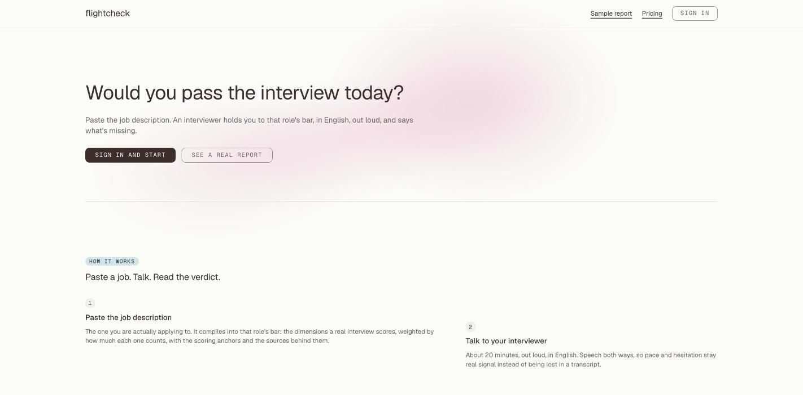
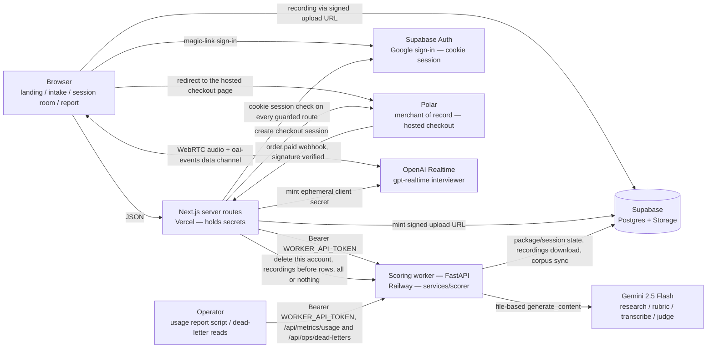

# flightcheck

**A pre-flight check for your English interview — built for non-native speakers facing interviews at global tech companies.** Paste the JD you're applying to; flightcheck interviews you by voice against that role's actual bar, scores both *what you said* (transcript) and *how you said it* (raw audio — native speech-to-speech, no transcription in the loop), and tells you honestly whether you're ready.

## Live

- **App:** https://flightcheck.vercel.app
- **Sample report (no signup):** https://flightcheck.vercel.app/sample-report
  — a real session run by the developer; flightcheck has no external users
  yet, so no customer's session is on display here
- **Price:** $49 per job description. The first package on an account is a
  trial with one scored session; $49 unlocks that same package — same JD,
  same rubric — to six 20-minute sessions, and a 30-day window starts at
  payment. No subscription, and no card field in the app: Polar is the
  merchant of record and checkout happens on its page
  ([pricing](https://flightcheck.vercel.app/pricing), DECISIONS #017–#018).




*Two stills from the running app, captured 2026-08-04 at the current design.
They replace a four-frame GIF recorded at v0.1: it showed a dark interface this
product no longer has, a verdict rendered as an amber warning badge the design
system now forbids, and no sign of why 4.27 out of 5 reads as "Approaching".
Its own caption had promised a re-record "when the visual pass lands", and the
visual pass has landed. What is still missing is a screen recording: it needs a
live 20-minute session rather than a screenshot, so these releases shipped
without one. That is on the record with the rest of what they did not ship —
see [CHANGELOG.md](CHANGELOG.md).*

*What these two do not show — sign-in, pricing, checkout, the session archive,
the progress screen — is everything the signed-in app grew after v0.1.*

### How it fits together



### Quickstart — the product

1. Sign in at https://flightcheck.vercel.app/login — Continue with Google, no password.
   Everything past the landing page is account-scoped: `/new` answers a
   signed-out visitor with a 307 to `/login?next=%2Fnew`. Then open
   https://flightcheck.vercel.app/new and paste a job description or its URL;
   optionally attach a resume PDF and a LinkedIn "Save to PDF" export
   (no scraping — DECISIONS #003). To read the output without an account, use
   the [sample report](https://flightcheck.vercel.app/sample-report) instead.
2. Wait for the rubric preview — 5-8 weighted dimensions, every one citing
   its sources — then press Start session and take the 20-minute voice
   interview in the browser (25-minute hard cut).
3. When scoring finishes, the report shows the verdict
   (Not yet ready / Approaching / Ready), per-dimension evidence, delivery
   metrics, and concrete drills — honestly, including "not ready yet".

### Quickstart — the code

A fresh clone runs its full test suite with no keys, no accounts and no
services. There is no root `package.json`, so the `npm` commands run from
`apps/web`:

```bash
git clone https://github.com/bridgewright/flightcheck.git
cd flightcheck/apps/web
npm ci
npm test              # 1863 tests, 71 files — 7 skip on a fresh clone
npm run dev           # http://localhost:3000
```

The seven that skip check that six user-visible sentences survive the production
bundler, so they need a build to read: `npm run gates` runs `build`, `test`,
`typecheck` and `lint` in that order and skips nothing. The order is the point —
a bundler destroyed shipped text once, and only the built output shows it.

The dev server needs no configuration, because the two public Supabase values
carry in-repo fallbacks (`apps/web/lib/supabase/config.ts`) — the landing page,
the sample report and pricing all render on a bare clone. Everything past them
(sign-in, the interview room, scoring, checkout) reads a secret named in
`REQUIRED_SERVER_ENV` (`apps/web/lib/env.ts`); those live in the deployment
environment and never in the repo, and [docs/deploy.md](docs/deploy.md) is how
they get there.

The scoring worker and the eval harness are Python, from `services/scorer`:

```bash
cd flightcheck/services/scorer
uv run pytest -q      # 862 tests
```

The rest of the release gate, each from the directory named: `npm run
typecheck`, `npm run lint` and `npm run build` in `apps/web`; `make test` and
`make lint` from the repo root; and `uv run scorer-evals` from
`services/scorer`, which is the only one of them that needs a model API key.

Release notes: [v0.7](docs/releases/v0.7.md) · [v0.6](docs/releases/v0.6.md) ·
[v0.5](docs/releases/v0.5.md) · [v0.2](docs/releases/v0.2.md) ·
[v0.1](docs/releases/v0.1.md) — one per tag, also published on the
[releases page](https://github.com/bridgewright/flightcheck/releases). Each
file carries its real release date on its first line; the timestamps GitHub
prints on that page are when the entry was published there, not when the
version shipped — the first three were published within three seconds of each
other, on 2026-08-03.
Architecture detail (data flow, storage layout): [docs/architecture.md](docs/architecture.md).
Deploy runbook: [docs/deploy.md](docs/deploy.md).

> **Status: v0.7.** Built in public. PRD was committed before the first line of code — [read it](PRD.md); the chronology is checkable below rather than asserted. The S2S provider bake-off that picked the interviewer and scoring models is measured, not guessed ([report](evals/reports/2026-08-02-provider-bakeoff.md)); the release-gate eval numbers are committed verbatim, including the runs that failed ([2026-08-03 v0.5 gate](evals/reports/2026-08-03-v05-gate.md), [2026-08-01 gate record](evals/reports/2026-08-01-v02-gate.md), [2026-07-26 gate run](evals/reports/2026-07-26-v01-gate.md)). Sample sizes in those gates are tiny and each report says so.

### Verify the PRD-before-code claim yourself

Locally, two commands:

```bash
git log --diff-filter=A --format='%H %ad %s' --date=iso -- PRD.md
git log --reverse --format='%h %ad %s' --date=iso | head -3
```

`PRD.md` is commit #1; the first source-tree commit lands six minutes later.
Six minutes is short enough to look like one working session split in two, so
here is what was inside it: that first `PRD.md` is 53 lines and already carries
six numeric success targets with their dates, and all six survive in
[PRD.md](PRD.md) today with the numbers unchanged.

Git dates are client-settable and these commits are not GPG-signed, so treat
that as a claim, not proof. The half the author cannot set is server-side:
this repository's GitHub `created_at` is `2026-07-25T05:42:10Z`, and the
earliest `PushEvent` on its public events feed is `2026-07-25T06:35:23Z` with
`before=875c61c2` — the docs-only commit that already contained `PRD.md`. So
the PRD was on GitHub before the first source push, which landed 53 minutes
after the repository was created. Both halves, checkable from anywhere:

```bash
curl -s https://api.github.com/repos/bridgewright/flightcheck | grep created_at

# The ordering evidence. This is the half that actually proves the PRD was on
# the server before any source, and it is the half that expires: GitHub serves
# only a recent window of a repository's public events, after which this
# returns nothing and the created_at check above is what is left.
curl -s "https://api.github.com/repos/bridgewright/flightcheck/events?per_page=100" \
  | grep -A6 '"before": "875c61c2'
```

## Why not just ChatGPT voice?

1. **A verdict, not a chat** — an evidence-grounded rubric compiled from your target JD and real interview experiences for that company and role, with behaviorally-anchored scoring.
2. **Delivery is scored from raw audio** — hesitation, fillers, hedging intonation. Cascade pipelines erase these before the model ever hears them.
3. **Growth across sessions** — a paid package is six sessions against the one JD, and the product reads them as a sequence: the session archive, per-dimension trends, the delta against your previous session, and recurring gaps and weak dimensions surfaced across sessions. What is *not* built yet, plainly: every session still runs the same baseline plan compiled from the rubric, so the questions do not vary session to session. The curriculum that aims each next session at your weak dimensions has now slipped two releases and no longer carries a version — see the Roadmap.

## Roadmap

- **v0.1** — the full single-session loop. Shipped 2026-07-26, tag `v0.1.0`.
- **v0.2** — interviewer UX: opens the call, tolerates thinking pauses, listens actively, manages the clock; the report explains its scores. Shipped 2026-08-01, tag `v0.2.0`.
- **v0.3 and v0.4** — report quality, accounts, the complete signed-in webapp, session history, progress. All of it shipped, none of it tagged: they ran as internal milestones and are folded into v0.5. There is no `v0.3.0` or `v0.4.0` tag.
- **v0.5** — payments. Polar hosted checkout, a signature-verified `order.paid` webhook, the $49 trial-then-unlock package. Shipped 2026-08-03, tag `v0.5.0`.
- **v0.6** — operating at scale: a real-usage metrics endpoint and report script, self-serve account deletion, a dead-letter record for permanently failed jobs, backoff on every model call, a scoring concurrency limit and an overall job deadline, security headers, request-id propagation and Sentry, and an adversarial prompt-injection suite added to the release gate. Shipped 2026-08-03, tag `v0.6.0`. [Release notes](docs/releases/v0.6.md).
- **v0.7** — the design pass: one design system enforced by a test rather than described in a document, light only, a landing cut to four blocks, and a report that draws why its verdict is what it is. Shipped 2026-08-04, tag `v0.7.0`. [Release notes](docs/releases/v0.7.md).

Both of those tags were cut on 2026-08-04, after the work was already in
production: `v0.6.0` sits on `da254e3`, exactly the commit that deployed on
2026-08-03. Putting a tag on a boundary that shipped is a different thing from
inventing one that never did, which is why there is still no `v0.3.0` or
`v0.4.0`.

Two things the list does not carry, and both are deliberate:

- **The pre-signup rubric preview shipped inside v0.6 and came out the same
  day.** Paste a job description on the landing page, see the bar it would be
  scored against, with no account. It ran in production and its guards held;
  on the page it read as an unexplained box, offered to a stranger before the
  page had said what the product is. It was removed whole rather than
  restyled, because the fault was placement. What that gives up — and what it
  buys back — is [DECISIONS.md](DECISIONS.md) #030.
- **Curriculum-lite has now missed two releases and no longer carries a
  version.** The published plan is left visible rather than rewritten:
  [DECISIONS.md](DECISIONS.md) #008 sequenced "v0.3 report quality → v0.4
  session history → v0.5 curriculum-lite → then payments". Payments took the
  v0.5 slot and curriculum-lite moved to v0.6; v0.6 then shipped without it,
  and so did v0.7. Rather than move the label a third time, this line records
  the gap: every session still runs the same baseline plan compiled from the
  rubric.

**On the payment path, precisely.** Exactly one $49 order exists. The author
placed it himself to prove checkout → webhook → provisioning end to end, then
refunded it and kept the receipt. It is evidence that the payment path works.
It is not a sale, not revenue, and not evidence of demand — flightcheck has no
external users and no paying customers. Real-usage metrics land with the first
external pilot ([docs/metrics/](docs/metrics/)); see [CHANGELOG.md](CHANGELOG.md)
for what each release contained.

MIT · Built AI-natively — see [CLAUDE.md](CLAUDE.md) · Decisions logged in [DECISIONS.md](DECISIONS.md) · Patterns in [PLAYBOOK.md](PLAYBOOK.md) · Honest retros in [RETRO.md](RETRO.md)
