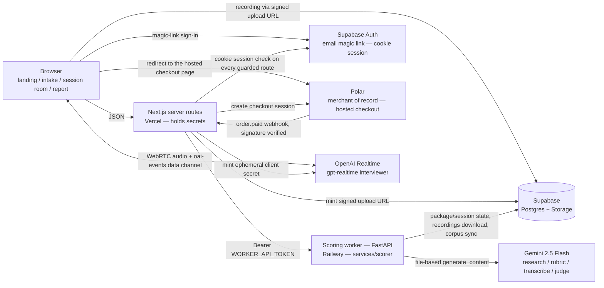

# Architecture

## v0.5 system (shipped)



### Data flow (one package, one session)

1. **Sign-in, then intake** — everything past the landing page is
   account-scoped: Supabase Auth mails a magic link, `/auth/callback` exchanges
   it for a cookie session, and each guarded route re-checks that session
   server-side before it renders. The browser then POSTs JD text or URL plus
   optional resume/LinkedIn PDFs (base64) to a Next.js route, which forwards to
   the worker with the bearer token. The owner is read from the cookie session
   and never from the request body, so a package is bound to an account from
   birth. The worker answers `202 {package_id, access_token}` and starts
   `compile_package` in the background. The browser never talks to the worker.
2. **Compile** — the worker normalizes intake (JD fetch, PDF extraction, profile
   build, hidden-payload stripping), runs the grounded research sweep (two-step:
   search with citations, then structure), and compiles the BARS rubric against
   the private corpus and few-shots. Package status: `compiling → ready |
   failed`. Intake hands the browser to `/rubric`, which polls until the package
   is ready and renders the cited rubric preview.
3. **Session** — Start Session creates a session row with a baseline
   `SessionPlan` and interviewer instructions. The session room mints a
   short-lived OpenAI ephemeral secret server-side, opens WebRTC to
   `gpt-realtime` ("Morgan"), and records the interview locally (webm). On
   completion the browser requests a token-authorized signed upload URL from a
   Next.js route and PUTs the recording directly to the private `recordings`
   bucket — the audio never transits a serverless function body. How many
   sessions the package will hand out is the paid quota (step 6).
4. **Score** — completing the session flips it to `scoring` and runs the
   pipeline: download → `ensure_wav` (ffmpeg) → verbatim transcription →
   eligibility gate → DSP delivery metrics → content judge (transcript vs BARS
   anchors) → delivery judge (actual audio; DSP conflicts flagged) →
   `compile_report` with the report-language lint. Status: `scoring → scored |
   insufficient | failed`. `insufficient` is the eligibility gate refusing to
   score a session that carries too little evidence — no judge calls, no
   report, and the slot stays retriable.
5. **Report** — the report page polls the session until `scored` and renders the
   verdict, per-dimension evidence, delivery metrics, and drills. Failures are
   shown honestly, never papered over.
6. **Payment and unlock** — the first package on an account is a trial with one
   scored session. `/checkout` creates a Polar hosted checkout session
   server-side, carrying `{package_id, user_id}` as metadata, and redirects the
   browser to Polar's page; no card field ever renders in this app. Polar posts
   `order.paid` back to `/api/webhooks/polar`, which verifies the signature over
   the raw body, resolves the order to exactly one owned package (metadata
   first, customer-email lookup as the fallback), and calls the worker's
   `POST /api/packages/{id}/paid`. The worker inserts the order row keyed on
   `polar_order_id` and flips the package to paid — six sessions, and a 30-day
   window anchored at `paid_at`, not at processing time. Both writes are
   idempotent, so a replayed delivery can never extend the window or unlock a
   second package.

**Secrets boundary:** the browser holds only short-lived, single-purpose
credentials — the Realtime ephemeral secret and a scoped signed upload URL for
its own recording path. Every long-lived key (`OPENAI_API_KEY`,
`GEMINI_API_KEY`, `WORKER_API_TOKEN`, `POLAR_ACCESS_TOKEN`,
`POLAR_WEBHOOK_SECRET`, Supabase service role) lives in Vercel or Railway
server env only. The worker's own HTTP surface is closed by default: bearer
auth on every `/api` route, `/healthz` the only public one, and FastAPI's
interactive docs (`/docs`, `/redoc`, `/openapi.json`) disabled.

## Security headers and capability hygiene

### The response policy

`apps/web/lib/security-headers.ts` builds the policy; `next.config.ts`
applies it through `headers()`, not through the proxy — the proxy's matcher
is an include-list of signed-in surfaces, so it never sees the landing page,
and `next.config` headers also reach prerendered responses.

| Header | Value | Why |
| --- | --- | --- |
| `Content-Security-Policy` | see below | exfiltration allowlist + injection primitives |
| `X-Frame-Options` / `frame-ancestors` | `DENY` / `'none'` | the room asks for a microphone; a report is private |
| `Permissions-Policy` | microphone denied everywhere except `/sessions/:id/room` | the one page that needs it |
| `Referrer-Policy` | `strict-origin-when-cross-origin`, `no-referrer` on `/p/*` | `/p/<token>` puts a capability in the path |
| `Strict-Transport-Security` | `max-age=63072000; includeSubDomains` | |
| `Cross-Origin-Opener-Policy` | `same-origin-allow-popups` | a popup-based OAuth sign-in must keep working |
| `X-Content-Type-Options` | `nosniff` | |

`connect-src` is the directive doing the most work: `'self'`, the Supabase
project origin (auth and the signed storage upload), `https://api.openai.com`
(the browser POSTs its WebRTC offer directly), and the Sentry ingest hosts.
Nothing else. Injected script cannot post a transcript to an attacker's host.

**`script-src` still allows `'unsafe-inline'`, and that is a stated
weakness.** Next inlines the RSC flight payload as a per-render
`<script>self.__next_f.push(...)</script>`, so no fixed hash covers it. The
strict alternative is a per-request nonce generated in the proxy — which
requires **every** page to be dynamically rendered, because a prerendered
page ships without the nonce and then renders as a blank screen under a CSP
demanding one. This app still prerenders `/login` and `/new`. A CSP that
blanks the sign-in page is worse than one that permits inline script, for
the same reason a CSP that breaks payment is worse than no CSP. Revisit when
every route is dynamic, or when Next emits a stable hash for its bootstrap.

What the policy is verified against, because a wrong CSP is a payment
outage: the Polar hosted-checkout hop (a server redirect on a GET
navigation, which no CSP directive governs — `form-action` names Polar
anyway so a future form-driven checkout cannot become an incident), the
Polar webhook's raw-body signature check (response headers only; nothing
touches a request body), the Supabase auth callback, and the room's
microphone plus its OpenAI connection. `lib/security-headers.test.ts` and
`tests/security-surface.test.ts` pin all of it, including that the
microphone exception still matches a route that exists.

### The room holds no capability

The room `access_token` used to be read from the package and passed to
`SessionRoom` as a prop — a permanent, package-wide capability serialized
into the page's RSC payload and echoed into three request bodies. Whoever
held that string could start and complete sessions on the package forever.

It is gone from the room. The room sends only a session id; the secret mint,
the upload URL mint, and session complete all authorize the signed-in
viewer, and the upload route now derives the package and slot from the
**authorized session row** rather than from the request — so nothing about
where a recording lands is under the caller's control.
`tests/room-token-hygiene.test.ts` is the gate.

It is not gone from the app. `/home`, `/progress` and `/rubric` still pass
the package `access_token` to `StartSessionButton`, because `POST
/api/sessions` still requires that credential to start a session. Those
three pages therefore still serialize a permanent package-wide capability
into their RSC payload. Retiring it needs the same move the upload route
just made — viewer authorization on `/api/sessions` — and is not done.

Migration 006's `access_token_expires_at` and `token_revoked_at` are honoured
by `lib/session-capability.ts`, which fails closed on anything it cannot
read and treats null as "no expiry" (the pre-006 behaviour).

> **Reads null today, so it never refuses.** The worker's hot session read
> (`SESSION_COLUMNS` in `api/db.py`) does not select the two columns and
> `_to_session_row` does not map them, so every session the web sees carries
> `null` for both — and nothing writes them at session create either. The
> guard is enforcement without a signal until both land. Delete this note in
> the commit that turns the columns on.

It gates
**entry** — rendering the room, minting the secret — and deliberately not
**finishing**: the recording upload and the complete call stay open, because
a window that lapsed at minute 19 of a 20-minute interview must never be the
reason a customer's session is thrown away. Revocation stops the next
session, not the one already recorded.

## Observability

### One id per unit of work

The web mints an `x-request-id` for each inbound request and forwards it on
every worker call that request makes (`apps/web/lib/worker.ts`, memoized with
React `cache()` so a page that fans out to four calls correlates as one
unit). The worker accepts it, generates one when absent, binds it to every
log record, and echoes it on the response — including on 401s and 404s that
never reach a route (`services/scorer/src/scorer/api/requestid.py`).

Worker log lines carry it in the format itself:

```
2026-08-03 10:11:12,345 INFO scorer.api.pipeline [req=8f1c…]: scoring session …
```

Lines with no request in scope — startup, the reaper loop, `tools/` scripts —
show `[req=-]` rather than a fabricated id.

### What /healthz should answer

`GET /healthz` on the worker returns `{"ok": true}` unconditionally. That is
a liveness lie, and it is how a dead Railway build kept serving traffic
while every new deploy failed: the platform's health check could not tell a
working process from a broken one.

`scorer.observability.run_health_checks` is the replacement, and it answers
with what it actually verified:

```json
{"ok": true, "checks": {"database": "ok"}, "release": "<commit sha>"}
```

> **Not yet served.** The endpoint itself lives in
> `services/scorer/src/scorer/api/routers/ops.py` and does not call this
> function yet, so `run_health_checks` ships tested but unused and
> `/healthz` still answers unconditionally. Delete this note in the commit
> that wires `build_public_router` to it — 503 when the report is not ok,
> which gates deployment promotion without restarting a running container.

- **Checks the database.** It is the only dependency the worker cannot serve
  a single request without, and a build that cannot reach it must never be
  promoted over one that can. The probe is a lookup for a token no package
  can hold: indexed, reads nothing real, writes nothing, and "no such
  package" is a successful round trip.
- **Does not check Gemini, OpenAI, or object storage.** They are slow,
  remote, rate-limited, and billed per call. A provider having a bad minute
  is not a reason to fail a deployment; that belongs to the pipeline's
  retries and the dead-letter path. A health check that fans out to every
  dependency turns any one of them into a total outage.
- **Every probe runs under a hard timeout** (2s). The second way a health
  check lies is by never answering at all.
- **`release` names the build that answered** — the question the incident
  could not answer.

### Error monitoring

`@sentry/nextjs` on the web (`instrumentation.ts` for server and edge,
`instrumentation-client.ts` for the browser), `sentry-sdk` on the worker.
Both are a clean no-op without a DSN, so monitoring is a deployment setting
rather than a code change.

The browser entry names every variable it reads as a literal
`process.env.NEXT_PUBLIC_X`. That is not style: `process` does not exist in
a browser, the bundler substitutes a value only where it sees that exact
member expression, and any other use resolves to a shim whose `env` is
`{}`. Handing `process.env` to a helper therefore compiles, builds, passes
tests that inject their own env — and reports nothing, forever, with a
correct DSN configured. `tests/instrumentation-client.test.ts` is the gate.

Two policies are not negotiable and are enforced in `lib/observability.ts`:

- `sendDefaultPii: false`. This product holds interview recordings and
  transcripts.
- Every event passes `redactedEvent` before it leaves. The legacy share
  links carry a package capability token **in the URL** (`/p/<token>`), and
  the Supabase auth callback carries a one-time `code`. An unredacted error
  report would hand a working credential to a third party and then email it.

Alert rules live in `docs/observability/sentry-alerts.yml` — configuration in
the repo, reviewable and restorable, rather than clicks someone did once.

## Configuration

### Where a number lives

`services/scorer/config/product.toml` is the single source for product
constants — model ids, session timing, eligibility floors, guard caps,
report thresholds. The rule is that a value appears once, and anything that
needs it in a second language mirrors it under a gate.

Session timing is the one value the browser must also know: the room shows
the budget, injects the pacing notes, and enforces the hard cut, so the
client owns the clock. `apps/web/lib/session-room.ts` therefore mirrors
`[session] budget_minutes` and `hard_cut_minutes` — and two tests fail if
the mirror drifts, one in each suite, because the suites run separately:

- `apps/web/tests/session-timing-ssot.test.ts`
- `services/scorer/tests/test_session_timing_ssot.py`

Change `product.toml` first; the mirror follows in the same commit. Widening
the full `product.toml` SSOT across the rest of the web app is v0.7.

### Deploy-time environment validation

`apps/web/lib/env.ts` lists every server variable a running deployment
cannot serve without, and `next.config.ts` asserts them at build. A missing
variable fails the Vercel build, so the previous build keeps serving — the
alternative was a 500 on a live page, or a checkout that "can't open right
now", discovered by a customer.

The check runs when `VERCEL` is set (every Vercel build, production and
preview) or when `FLIGHTCHECK_REQUIRE_ENV=1` is passed explicitly. A local
`npm run build` is exempt on purpose: production secrets live in the
deployment platform, never in the repo, so failing local builds would only
teach people to skip the build. Error messages carry variable **names**
only — build logs are readable by anyone with repository access.

### Database migrations

`docs/supabase/migrations/NNN_name.sql` is the ledger. There is no migration
runner: the operator pastes each file into the Supabase SQL editor in
filename order (`docs/deploy.md` §1.2). That makes the discipline the
mechanism, so it is written down here rather than assumed:

1. **One file per change, never edited after it has been applied.** A file
   that has run against production is history. Corrections ship as the next
   number.
2. **Additive and idempotent only** — `add column if not exists`, new tables,
   new indexes. No drops, no renames, no `not null` without a default. Both
   the old and the new build serve traffic during a deploy window, so every
   migration must be safe for a build that has never heard of it, and
   re-running a file must be a no-op.
3. **Apply before the build that needs it.** The worker assumes its columns
   exist; the web build assumes the worker's payload shape. Order is
   migration → worker deploy → web deploy.
4. **Nullable means "not yet".** A column added ahead of the code that fills
   it is null on every existing row, and the reader must treat null as
   today's behaviour rather than as an error. `006_token_hygiene.sql` is the
   worked example: a null `access_token_expires_at` means "no expiry", which
   is exactly what shipped before the column existed.
5. **Applied state is verified, not remembered.** Before tagging a release,
   confirm the columns the release depends on actually exist:

   ```sql
   select table_name, column_name
   from information_schema.columns
   where table_schema = 'public'
     and table_name in ('packages', 'sessions', 'orders')
   order by table_name, ordinal_position;
   ```

   The release notes for each version name the migrations that version
   requires, and that query is how the operator checks them off.

---

*Re-headed for v0.5 on 2026-08-03. This file said "v0.1 system" and carried a
diagram with no auth node and no payments node through the whole v0.3–v0.5 arc
— accounts, the signed-in app, and the entire payment path shipped without it
following. Two claims in the data flow were false by the time the release
audit found them: the rubric preview had moved off the token-routed package
page onto `/rubric`, and the scoring pipeline had grown an eligibility gate and
an `insufficient` terminal status. Corrected here rather than quietly rewritten.*
