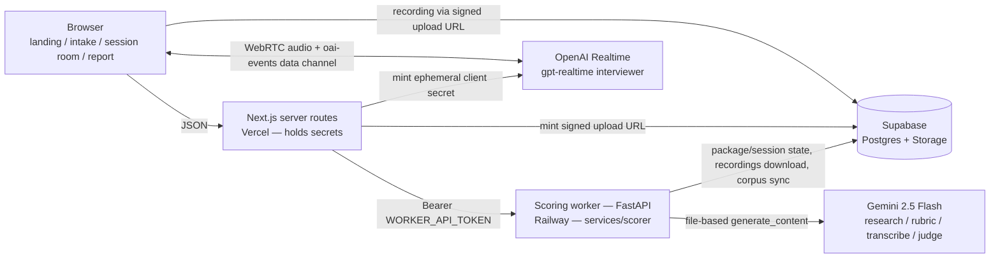

# Architecture

## v0.1 system (shipped)

### Data flow (one package, one session)

1. **Intake** — the browser POSTs JD text or URL plus optional resume/LinkedIn
   PDFs (base64) to a Next.js route, which forwards to the worker with the
   bearer token. The worker answers `202 {package_id, access_token}` and starts
   `compile_package` in the background. The browser never talks to the worker.
2. **Compile** — the worker normalizes intake (JD fetch, PDF extraction, profile
   build), runs the grounded research sweep (two-step: search with citations,
   then structure), and compiles the BARS rubric against the private corpus and
   few-shots. Package status: `compiling → ready | failed`. The package page
   polls by access token and renders the cited rubric preview.
3. **Session** — Start Session creates a session row with a baseline
   `SessionPlan` and interviewer instructions. The session room mints a
   short-lived OpenAI ephemeral secret server-side, opens WebRTC to
   `gpt-realtime` ("Morgan"), and records the interview locally (webm). On
   completion the browser requests a token-authorized signed upload URL from a
   Next.js route and PUTs the recording directly to the private `recordings`
   bucket — the audio never transits a serverless function body.
4. **Score** — completing the session flips it to `scoring` and runs the
   pipeline: download → `ensure_wav` (ffmpeg) → verbatim transcription → DSP
   delivery metrics → content judge (transcript vs BARS anchors) → delivery
   judge (actual audio; DSP conflicts flagged) → `compile_report` with the
   report-language lint. Status: `scoring → scored | failed`.
5. **Report** — the report page polls the session until `scored` and renders the
   verdict, per-dimension evidence, delivery metrics, and drills. Failures are
   shown honestly, never papered over.

**Secrets boundary:** the browser holds only short-lived, single-purpose
credentials — the Realtime ephemeral secret and a scoped signed upload URL for
its own recording path. Every long-lived key (`OPENAI_API_KEY`,
`GEMINI_API_KEY`, `WORKER_API_TOKEN`, Supabase service role) lives in Vercel or
Railway server env only.
