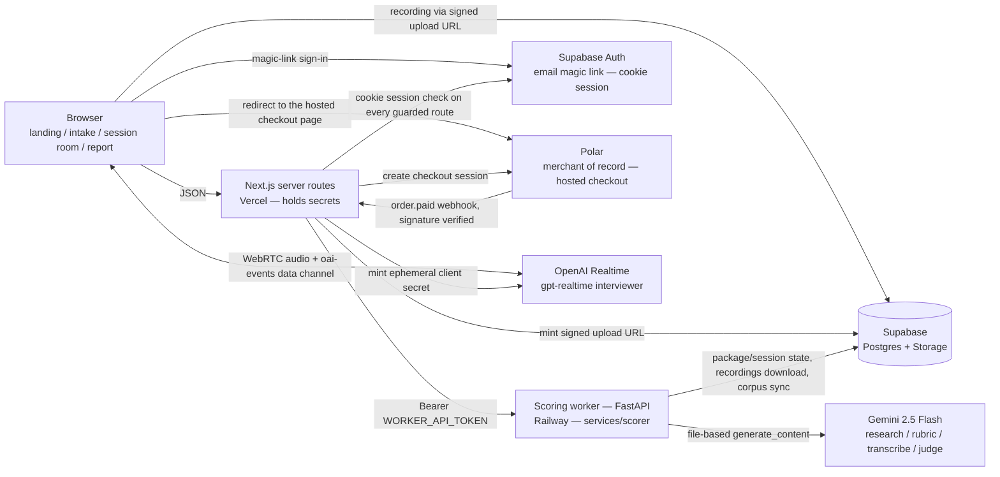

# Architecture

## v0.5 system (shipped)



### Data flow (one package, one session)

1. **Sign-in, then intake** — everything past the landing page is
   account-scoped: Supabase Auth mails a magic link, `/auth/callback` exchanges
   it for a cookie session, and each guarded route re-checks that session
   server-side before it renders. The browser then POSTs JD text or URL plus
   optional resume/LinkedIn PDFs (base64) to a Next.js route, which forwards to
   the worker with the bearer token. The owner is read from the cookie session
   and never from the request body, so a package is bound to an account from
   birth. The worker answers `202 {package_id, access_token}` and starts
   `compile_package` in the background. The browser never talks to the worker.
2. **Compile** — the worker normalizes intake (JD fetch, PDF extraction, profile
   build, hidden-payload stripping), runs the grounded research sweep (two-step:
   search with citations, then structure), and compiles the BARS rubric against
   the private corpus and few-shots. Package status: `compiling → ready |
   failed`. Intake hands the browser to `/rubric`, which polls until the package
   is ready and renders the cited rubric preview.
3. **Session** — Start Session creates a session row with a baseline
   `SessionPlan` and interviewer instructions. The session room mints a
   short-lived OpenAI ephemeral secret server-side, opens WebRTC to
   `gpt-realtime` ("Morgan"), and records the interview locally (webm). On
   completion the browser requests a token-authorized signed upload URL from a
   Next.js route and PUTs the recording directly to the private `recordings`
   bucket — the audio never transits a serverless function body. How many
   sessions the package will hand out is the paid quota (step 6).
4. **Score** — completing the session flips it to `scoring` and runs the
   pipeline: download → `ensure_wav` (ffmpeg) → verbatim transcription →
   eligibility gate → DSP delivery metrics → content judge (transcript vs BARS
   anchors) → delivery judge (actual audio; DSP conflicts flagged) →
   `compile_report` with the report-language lint. Status: `scoring → scored |
   insufficient | failed`. `insufficient` is the eligibility gate refusing to
   score a session that carries too little evidence — no judge calls, no
   report, and the slot stays retriable.
5. **Report** — the report page polls the session until `scored` and renders the
   verdict, per-dimension evidence, delivery metrics, and drills. Failures are
   shown honestly, never papered over.
6. **Payment and unlock** — the first package on an account is a trial with one
   scored session. `/checkout` creates a Polar hosted checkout session
   server-side, carrying `{package_id, user_id}` as metadata, and redirects the
   browser to Polar's page; no card field ever renders in this app. Polar posts
   `order.paid` back to `/api/webhooks/polar`, which verifies the signature over
   the raw body, resolves the order to exactly one owned package (metadata
   first, customer-email lookup as the fallback), and calls the worker's
   `POST /api/packages/{id}/paid`. The worker inserts the order row keyed on
   `polar_order_id` and flips the package to paid — six sessions, and a 30-day
   window anchored at `paid_at`, not at processing time. Both writes are
   idempotent, so a replayed delivery can never extend the window or unlock a
   second package.

**Secrets boundary:** the browser holds only short-lived, single-purpose
credentials — the Realtime ephemeral secret and a scoped signed upload URL for
its own recording path. Every long-lived key (`OPENAI_API_KEY`,
`GEMINI_API_KEY`, `WORKER_API_TOKEN`, `POLAR_ACCESS_TOKEN`,
`POLAR_WEBHOOK_SECRET`, Supabase service role) lives in Vercel or Railway
server env only. The worker's own HTTP surface is closed by default: bearer
auth on every `/api` route, `/healthz` the only public one, and FastAPI's
interactive docs (`/docs`, `/redoc`, `/openapi.json`) disabled.

## Configuration

### Where a number lives

`services/scorer/config/product.toml` is the single source for product
constants — model ids, session timing, eligibility floors, guard caps,
report thresholds. The rule is that a value appears once, and anything that
needs it in a second language mirrors it under a gate.

Session timing is the one value the browser must also know: the room shows
the budget, injects the pacing notes, and enforces the hard cut, so the
client owns the clock. `apps/web/lib/session-room.ts` therefore mirrors
`[session] budget_minutes` and `hard_cut_minutes` — and two tests fail if
the mirror drifts, one in each suite, because the suites run separately:

- `apps/web/tests/session-timing-ssot.test.ts`
- `services/scorer/tests/test_session_timing_ssot.py`

Change `product.toml` first; the mirror follows in the same commit. Widening
the full `product.toml` SSOT across the rest of the web app is v0.7.

### Deploy-time environment validation

`apps/web/lib/env.ts` lists every server variable a running deployment
cannot serve without, and `next.config.ts` asserts them at build. A missing
variable fails the Vercel build, so the previous build keeps serving — the
alternative was a 500 on a live page, or a checkout that "can't open right
now", discovered by a customer.

The check runs when `VERCEL` is set (every Vercel build, production and
preview) or when `FLIGHTCHECK_REQUIRE_ENV=1` is passed explicitly. A local
`npm run build` is exempt on purpose: production secrets live in the
deployment platform, never in the repo, so failing local builds would only
teach people to skip the build. Error messages carry variable **names**
only — build logs are readable by anyone with repository access.

### Database migrations

`docs/supabase/migrations/NNN_name.sql` is the ledger. There is no migration
runner: the operator pastes each file into the Supabase SQL editor in
filename order (`docs/deploy.md` §1.2). That makes the discipline the
mechanism, so it is written down here rather than assumed:

1. **One file per change, never edited after it has been applied.** A file
   that has run against production is history. Corrections ship as the next
   number.
2. **Additive and idempotent only** — `add column if not exists`, new tables,
   new indexes. No drops, no renames, no `not null` without a default. Both
   the old and the new build serve traffic during a deploy window, so every
   migration must be safe for a build that has never heard of it, and
   re-running a file must be a no-op.
3. **Apply before the build that needs it.** The worker assumes its columns
   exist; the web build assumes the worker's payload shape. Order is
   migration → worker deploy → web deploy.
4. **Nullable means "not yet".** A column added ahead of the code that fills
   it is null on every existing row, and the reader must treat null as
   today's behaviour rather than as an error. `006_token_hygiene.sql` is the
   worked example: a null `access_token_expires_at` means "no expiry", which
   is exactly what shipped before the column existed.
5. **Applied state is verified, not remembered.** Before tagging a release,
   confirm the columns the release depends on actually exist:

   ```sql
   select table_name, column_name
   from information_schema.columns
   where table_schema = 'public'
     and table_name in ('packages', 'sessions', 'orders')
   order by table_name, ordinal_position;
   ```

   The release notes for each version name the migrations that version
   requires, and that query is how the operator checks them off.

---

*Re-headed for v0.5 on 2026-08-03. This file said "v0.1 system" and carried a
diagram with no auth node and no payments node through the whole v0.3–v0.5 arc
— accounts, the signed-in app, and the entire payment path shipped without it
following. Two claims in the data flow were false by the time the release
audit found them: the rubric preview had moved off the token-routed package
page onto `/rubric`, and the scoring pipeline had grown an eligibility gate and
an `insufficient` terminal status. Corrected here rather than quietly rewritten.*
